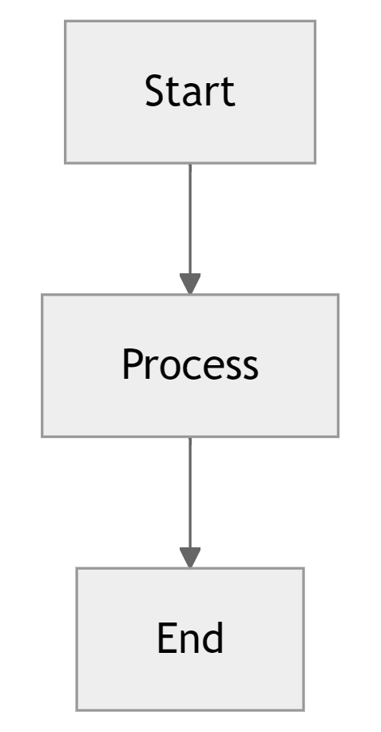

# DeepSearch - A Hard Working Search Engine 🔍

DeepSearch trains a small language model to develop effective search behaviors instead of memorizing static data. It interacts with multiple synthetic search engines, each with unique retrieval mechanisms, to refine queries and persist in searching until it finds exact answers. The project focuses on reinforcement learning, preventing overfitting, and optimizing for efficiency in real-world search applications.



## Setup

```bash
python -m venv .venv
source .venv/bin/activate
pip install -r requirements.txt
```

## Models

You can find our models on Hugging Face 🤗! We're committed to open-source and easy access for the research community.

| Model | Backbone | Size | Link |
|-------|----------|------|------|
| - | - | - | - |

## Datasets

We've released our datasets on Hugging Face 🤗 to support reproducibility and further research.

| Dataset                             | Description                                         | Size  | Link                                                                                    |
|--------------------------------------|-----------------------------------------------------|-------|-----------------------------------------------------------------------------------------|
| -                                    | -                                                   | -     | -                                                                                       |
| -                                    | -                                                   | -     | -                                                                                       |
| -                                    | -                                                   | -     | -                                                                                       |

## References

- This project is kickstarted from [AutoDidact](https://github.com/dCaples/AutoDidact)

## Personal Notes

- **This is research code**, so I'm prioritizing speed over code quality for now. Expect things to be messy—both the code and commit history. Roasting is welcome, but don't judge me too hard; I'll clean it up later. **I don’t know what I don’t know**, but I’m eager (and desperate) to learn and improve, so any constructive feedback is highly appreciated! 💖
