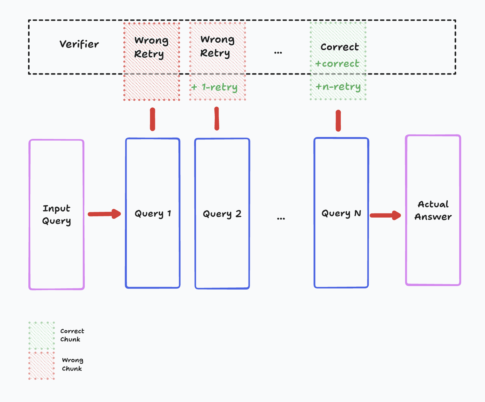

<div align="center">

# ReZero: Enhancing LLM search ability by trying one-more-time



ReZero trains a small language model to develop effective search behaviors instead of memorizing static data. It interacts with multiple synthetic search engines, each with unique retrieval mechanisms, to refine queries and persist in searching until it finds exact answers. The project focuses on reinforcement learning, preventing overfitting, and optimizing for efficiency in real-world search applications.

[**Quick Demo**](#quick-demo-) | [**Setup**](#setup-️) | [**Data and Training**](#data-and-training-) | [**Models**](#models-) | [**Experiments**](#experiments-) | [**References**](#references-) | [**Acknowledgements**](#acknowledgements-)

</div>

## Setup 🛠️

```bash
# Clone the repository
git clone https://github.com/menloresearch/ReZero
cd ReZero

# Create virtual environment
python -m venv .venv

# Activate the environment
source .venv/bin/activate

# Install dependencies
pip install --upgrade pip
pip install -e .

# Set up environment variables (required for websearch demo)
cp .env.example .env
# Edit .env and add your Tavily API key if you want to use the websearch demo
```

## Quick Demo 🚀

<div align="center">
  
</div>

Run the interactive web interface to see ReZero in action:

```bash
python app.py
```

This will launch a Gradio interface where you can interact with the model and test different search behaviors.

## Data and Training 🧠

All necessary training data is included in the `data/` folder. To train:

```bash
python train_grpo.py
```

If you want to regenerate the data, please run:

```bash
python scripts/generate_data.py
```

## Models 🤖

You can find our models on Hugging Face 🤗! We're committed to open-source and easy access for the research community.

| Model | Backbone | Size | Link |
|-------|----------|------|------|
| ReZero-v0.1 | Llama-3.2-3B | 3B | [🤗 Menlo/ReZero-v0.1-llama-3.2-3b-it-grpo-250404](https://huggingface.co/Menlo/ReZero-v0.1-llama-3.2-3b-it-grpo-250404) |

## Experiments 🧪

| Run ID | Model Config | Dataset | Steps | Hardware | TensorBoard | Description |
|--------|--------------|---------|-------|----------|-------------|-------------|
| exp-01 | [Llama-3.2-3b-instruct](https://huggingface.co/janhq/250404-llama-3.2-3b-instruct-grpo-01) | Apollo Mission Report | 300 | ~2 hours on 1xH200 | [📊](https://huggingface.co/janhq/250404-llama-3.2-3b-instruct-grpo-01/tensorboard) | Added reward_search_strategy and reward_search_quality. Reward weights: [4.0, 2.0, 1.0, 1.0, 1.0, 1.0]. Loss crashed after step 400. Best accuracy: 31.25% at step 400. Max agent turns: 10. |
| exp-02 | [Llama-3.2-3b-instruct](https://huggingface.co/janhq/250404-llama-3.2-3b-instruct-grpo-02) | Apollo Mission Report | 1000 | ~7 hours on 1xH200 | [📊](https://huggingface.co/janhq/250404-llama-3.2-3b-instruct-grpo-02/tensorboard) | Improved reward_retry logic to only reward search when answers found. Increased max agent turns to 20. Reward weights: [4.0, 2.0, 1.0, 1.0, 1.0, 1.0]. Best accuracy: 46.88% at step 250. Higher early reward_correctness (~0.6 vs 0.4-0.5). Loss stable but reward crashed after step 350. |
| exp-03 | [Llama-3.2-3b-instruct](https://huggingface.co/janhq/250409-llama-3.2-3b-instruct-grpo-01-no-retry) | Apollo Mission Report | 1000 | ~7 hours on 1xH200 | [📊](https://huggingface.co/janhq/250409-llama-3.2-3b-instruct-grpo-01-no-retry/tensorboard) | Same as exp-02 but without the retry reward function. |

## References 📖

## Acknowledgements 🤝

- This project is kickstarted from the source code of [AutoDidact](https://github.com/dCaples/AutoDidact)
