# Dataset

This document describes the creation of a data pipeline to generate a dataset.

## Implementation Phases

- [ ] 1.Simple chunk paraphrasing logic that's just work
    - After splitting, feed the splitted chunks into LLM to paraphrase
    - Rebuil the FAISS index with the paraphrased chunks
    - Don't touch `question.json`
- [ ] 2.Enhance the dataset quality with API (check backlog)

## Inital idea from @tikikun

- Take a dataset and break it into chunks.
- Use the **ground truth chunks** (the original, correct ones).
- Use an AI model to **paraphrase** those chunks—rewrite them in a different way while keeping the same meaning.
- During training, give the model these **paraphrased chunks** and ask it to **search for the original chunk**.
- If the model finds the correct original chunk, it gets a **reward**.
- This way, the model learns to **retrieve the most accurate chunk** even when given noisy or reworded input.

### Why Does This Work?

- **Paraphrasing adds noise**, making the training more realistic.
- The model learns to **recover the true information** from different ways of saying it.
- It ensures the model **only stops searching when it finds the exact right answer**.
- This makes retrieval stronger because it trains the model to handle **real-world variations in wording**.

### Derived from flow matcing

- Flow Matching is a generative modeling technique that trains models to transform simple distributions **(like noise)** into complex data distributions by learning continuous transformations, or "flows"
- Paraphrase as Noise Introduction: By paraphrasing original data chunks, we introduce controlled noise, creating variations that maintain the original meaning but differ in wording.​
- Model Training with Paraphrased Data: The model is trained to map these paraphrased (noisy) chunks back to their original form, learning to navigate from noise to truth.

## Dataset Format

- Should start from AutoDidact `generate_dataset.py`
- Output 3 things:
    - Document chunks.pkl
    - questions.json
    - faiss_index
- `question.json`:

```json
{
    "chunk_id": "chunk_1",
    "question": "What is the capital of France?",
    "answer": "Paris",
    "difficulty": "easy"
}
```

- Original Flow: load markdown -> split into chunks -> generate embeddings -> build FAISS index -> generate questions

```mermaid
graph TD

    %% === Document Processing and Embedding Generation ===
    A1[Load Markdown Document] -->|mission_report.md| A2[Split Document into Chunks]
    A2 -->|Save as Pickle| A3[💾 Chunks saved_data/chunks.pkl]

    A3 -->|Load Chunks| B1[Generate Embeddings]
    B1 -->|Save Embeddings| B2[Build FAISS Vector Store]
    B2 -->|Save FAISS Index| B3[💾 FAISS Index faiss_index]

    %% === QA Pair Generation ===
    C1[Load Llama Model] -->|meta-Llama-3.1-8B-Instruct| C2[Configure Sampling Params]

    A3 -->|Load Chunks| D1[Prepare Sliding Window Prompts]
    D1 -->|Batch Generation| D2[Generate QA Pairs]
    D2 -->|Parse & Validate QA Pairs| D3[Filter Valid Pairs]
    D3 -->|Save Questions| D4[💾 QA Pairs saved_data/questions.json]

    %% === Error Handling ===
    D2 -->|Retry Failed Prompts| D5[Retry Batch Generation]
    D5 -->|Parse & Validate QA Pairs| D3

    %% Dependencies
    A1 -.->|Required| B1
    A3 -.->|Required| D1
    C1 -.->|Required| D2
    C2 -.->|Required| D2
    B3 -.->|Required| D2

```



## Get a sense of how to prepare the dataset for GRPO

- <https://docs.unsloth.ai/basics/reasoning-grpo-and-rl/tutorial-train-your-own-reasoning-model-with-grpo#data-preparation>
    - > Your dataset should still have at least **2 columns for question and answer pairs**. However the **answer must not reveal the reasoning behind** how it derived the answer from the question. See below for an example:
- Cool basic stuff <https://docs.unsloth.ai/basics/datasets-101>
