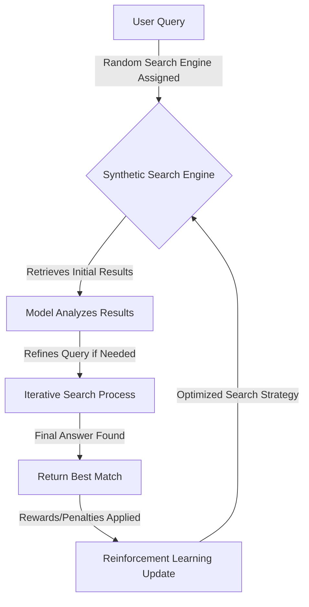

```mermaid
graph TD
    A[User Query] -->|Random Search Engine Assigned| B{Synthetic Search Engine}
    B -->|Retrieves Initial Results| C[Model Analyzes Results]
    C -->|Refines Query if Needed| D[Iterative Search Process]
    D -->|Final Answer Found| E[Return Best Match]
    E -->|Rewards/Penalties Applied| F[Reinforcement Learning Update]
    F -->|Optimized Search Strategy| B

```
