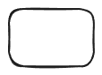

# R1 Searcher

<https://github.com/RUCAIBox/R1-Searcher>

We employ a **Two-Stage Reward Guided RL Training**approach:

Stage 1: Learn to invoke search with only format-reward.

Stage 2: Learn to solve questions with invoking search with format-reward and answer-reward.

## Algorithm

We use only outcome-supervised reinforcement learning for training, so we need to consider two main aspects: (1) the reinforcement learning algorithm, and (2) the design of the reward.

## RL Algorithm

We use Reinforce++ as our RL algorithm. For each questions, we average the rewards of n samples, which stabilizes the training process. For the solution format, we utilize <think>...</think> tag for thinking, xxx for searching, and <answer>...</answer> for answering, <begin_of_search>...<end_of_search> for invoking search tool and <begin_of_documents>...<end_of_documents> for returned retrieval documents

Reward Design：In Stage-1, we use the retrieve-reward: if the model performs retrieval and the solution meets the format requirements, 0.5 points are added to the answer reward. In Stage 2, the retrieval requirement is removed and we utilize the F1-based answer-reward. A penalty of 2 points is subtracted from the answer reward if the solution does not meet the format requirements. Detailed implementation, including hyperparameters can be found in our code.
