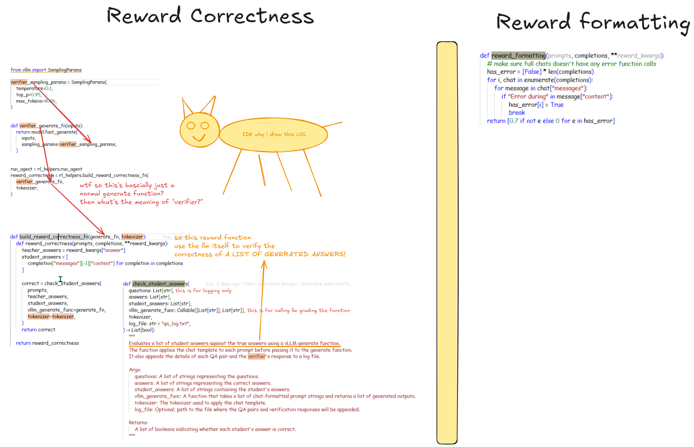

# Reward functions

This note is a collection of stolen reward functions and tips from other projects.

- NEED SOMETHING THAT MAKE THE MODEL WORK HARDER!!!
- [x] Goal: design reward functions (Search Task!) for DeepSearch's GRPO trainings (likely to be exact match) (**Try the suggestion by unsloth below, lol**)
    - > You can refer to the examples below. You can input your generations into an LLM like ChatGPT 4o or Llama 3.1 (8B) and design a reward function and verifier to evaluate it. **For example, feed your generations into a LLM of your choice and set a rule: "If the answer sounds too robotic, deduct 3 points." This helps refine outputs based on quality criteria**
    - Label studio suggest consult domain experts -> ask the LLM to be search engine expert??
    - Starting from the default of AutoDiact should be good enough, then figure out big brain moves from there

- [x] Reward exact matches only, don't increase gradually. For example, 4 or 5 attempts would get 1 point or half a point, don't scale up (e.g., 10 attempts doesn't scale up further) (don't reward retry behavior)
    - Insight from Alphamaze: don't plan for too many cases, scope down to just 1-2 things to generalize rather than being too detailed

## Implementation Phases

- [x] V0. Just keep the default ones from AutoDidact and add the Exact Match Idea
    - Oh they only use 2 reward functions "reward_correctness" and "reward_formatting"
- [x] V1. Add more reward functions
    - Retrying
        - Need mechanism to count number of retrying attempts
        - log chat state
        - ~~add xml tag each time it call search function, count number of xml tags~~ can just count number of json object, BUT one assitant response can only have 1 function call according to the code (why is this?)
        - but how does the model know when to stop retrying? -> the model will decide this itself with the <answer> tag.
    - Exact match (for chunk querying, not outcome)
        - can just check chunk ID?
        - each time it retry, it will add one more result, so we reward all of the results or just the last one?
    - Hold up, Do I also need LLM for those two? - NO, we are doing exact match, just write the rules, then if else

## Anatomy of reward_correctness and reward_formatting

The `reward_correctness` and `reward_formatting` functions are key components in our reinforcement learning setup. Let's break down how they work:

- `reward_correctness`
    - Student LLM generate the answer
    - Generated answer is compared with the correct answer, scoring by another LLM
- `reward_formatting`
    - Student LLM generate the answer
    - Generated answer is compared with the correct answer, scoring by another LLM



## Get a sense of Reward functions

- <https://github.com/huggingface/trl/blob/main/docs/source/grpo_trainer.md#example-4-multi-task-reward-functions>
- <https://github.com/kubernetes-bad/reward-composer>
    - Reward Composer is a collection of simple building blocks for making your perfect reward function for Reinforcement Learning training of language models... It's like Lego for GRPO.
- <https://gist.github.com/willccbb/4676755236bb08cab5f4e54a0475d6fb>
    - Really minimalist and simple grpo training script (only 171 lines :O)
- Example form unsloth's blog <https://docs.unsloth.ai/basics/reasoning-grpo-and-rl#reward-function-examples>
    - > You can **reuse data** across multiple epochs. - What does this mean 👀?

- From <https://labelstud.io/blog/reinforcement-learning-from-verifiable-rewards/#how-to-design-a-verifiable-reward-function>
    - Factual Accuracy: Checking whether the output contains verifiable facts.
    - Logical Consistency: Ensuring that arguments or narratives are internally consistent. Ensure solving propositional logic reasoning problems
    - Exact Match and Heuristics: Use deterministic rules to check correctness (e.g., exact match in math answers, passing test cases in code, **matching the predefined categories or taxonomy** etc.)
    - > Designing a verifiable reward function **requires expert knowledge, domain expertise**, and structured data interfaces - Can I just LLM Roleplaying search engine expert? 👀
    - Multi-Level Scoring: Implement tiered scoring mechanisms to reward partial correctness where applicable. (cool, might try this)
    - > 3. Validate the Reward Model Based on Generated Examples
Run Controlled Tests: Generate model outputs and measure how well the reward function distinguishes correct from incorrect responses.
Evaluate for Robustness: Ensure the function avoids penalizing correct responses due to formatting issues or minor variations.
A/B Testing with RL Agents: Compare performance between models trained with and without the verifiable reward function.

## Reward Scaling

- <https://www.restack.io/p/reinforcement-learning-answer-reward-scaling-cat-ai>

- Linear Scaling: This involves multiplying the rewards by a constant factor. For example, if the original reward is 10 and we apply a scaling factor of 0.1, the new reward becomes 1. This method is straightforward but may not always be effective.
- Non-linear Scaling: More complex functions can be used to scale rewards, such as logarithmic or exponential functions. These can help in situations where the distribution of rewards is skewed.
- Adaptive Scaling: This technique adjusts the scaling factor dynamically based on the agent's performance or the variance of received rewards. For instance, if the agent is consistently receiving low rewards, the scaling factor can be increased to encourage more exploration.

## Negative Reward?

- <https://github.com/huggingface/trl/issues/2832>
- > It doesn't matter if you have negative or positive weights -- all that matters is the group relative advantage. Rewards of {1, 0} will result in advantages of 1 and -1 respectively. That is the same as rewards of {1,-1} which results in 1, -1 Or consider rewards of {1, 1, 2}, this will result in advantages of -1/sqrt(2), -1/sqrt(2), sqrt(2)
  
## Reward Function vs Verifier

Stolen note from unsloth's docs:

| Component | Purpose | Characteristics | Examples |
|-----------|---------|-----------------|----------|
| **Verifier** | Determines correctness | - No numerical scoring<br>- Binary correct/incorrect judgment | - Checks if "2+2=5" is wrong<br>- Executes code to validate syntax/logic |
| **Reward Function** | Assigns numerical scores | - Converts verification to numbers<br>- Can include multiple criteria | - Wrong answer: -1 or -2<br>- Correct answer: +1 or +2<br>- Penalties for length/readability |
| **Key Differences** | | - Verifier: checks correctness without scoring<br>- Reward Function: assigns scores without necessarily verifying<br>- Reward Function can use a Verifier, but they're distinct components | |

## Idea examples

Note taken from unsloth's docs.

Example #1: Simple Arithmetic Task

- Question: "2 + 2"
- Answer: "4"
- Reward Function 1:
    - If a number is detected → +1
    - If no number is detected → -1

Example #2: Email Automation Task

- Question: Inbound email
- Answer: Outbound email
- Reward Functions:
    - If the answer contains a required keyword → +1
    - If the answer exactly matches the ideal response → +1
    - If the response is too long → -1
    - If the recipient's name is included → +1
    - If a signature block (phone, email, address) is present → +1

## Code Examples

- Below is a code snippet from @unslothai sample notebook, which is taken from @willccbb's gist

```python
# Reward functions
def correctness_reward_func(prompts, completions, answer, **kwargs) -> list[float]:
    responses = [completion[0]["content"] for completion in completions]
    q = prompts[0][-1]["content"]
    extracted_responses = [extract_xml_answer(r) for r in responses]
    print(
        "-" * 20,
        f"Question:\n{q}",
        f"\nAnswer:\n{answer[0]}",
        f"\nResponse:\n{responses[0]}",
        f"\nExtracted:\n{extracted_responses[0]}",
    )
    return [2.0 if r == a else 0.0 for r, a in zip(extracted_responses, answer)]


def int_reward_func(completions, **kwargs) -> list[float]:
    responses = [completion[0]["content"] for completion in completions]
    extracted_responses = [extract_xml_answer(r) for r in responses]
    return [0.5 if r.isdigit() else 0.0 for r in extracted_responses]


def strict_format_reward_func(completions, **kwargs) -> list[float]:
    """Reward function that checks if the completion has a specific format."""
    pattern = r"^<reasoning>\n.*?\n</reasoning>\n<answer>\n.*?\n</answer>\n$"
    responses = [completion[0]["content"] for completion in completions]
    matches = [re.match(pattern, r) for r in responses]
    return [0.5 if match else 0.0 for match in matches]


def soft_format_reward_func(completions, **kwargs) -> list[float]:
    """Reward function that checks if the completion has a specific format."""
    pattern = r"<reasoning>.*?</reasoning>\s*<answer>.*?</answer>"
    responses = [completion[0]["content"] for completion in completions]
    matches = [re.match(pattern, r) for r in responses]
    return [0.5 if match else 0.0 for match in matches]


def count_xml(text) -> float:
    count = 0.0
    if text.count("<reasoning>\n") == 1:
        count += 0.125
    if text.count("\n</reasoning>\n") == 1:
        count += 0.125
    if text.count("\n<answer>\n") == 1:
        count += 0.125
        count -= len(text.split("\n</answer>\n")[-1]) * 0.001
    if text.count("\n</answer>") == 1:
        count += 0.125
        count -= (len(text.split("\n</answer>")[-1]) - 1) * 0.001
    return count


def xmlcount_reward_func(completions, **kwargs) -> list[float]:
    contents = [completion[0]["content"] for completion in completions]
    return [count_xml(c) for c in contents]


...

trainer = GRPOTrainer(
    model=model,
    processing_class=tokenizer,
    reward_funcs=[ # Personal note: didn't expect this be so simple to implement @@
        xmlcount_reward_func,
        soft_format_reward_func,
        strict_format_reward_func,
        int_reward_func,
        correctness_reward_func,
    ],
    args=training_args,
    train_dataset=dataset,
)
trainer.train()

```

- [x] Just curious, how did the team implemented the reward functions for [Alphamaze](https://github.com/menloresearch/visual-thinker)?

- Below is from Alphamaze's repo
    - > We designed a reward function 3 components. Correctness Reward (+0.2 per solution step): This reward is scaled according to the number of steps in the maze solution. Each valid movement step adds 0.2 points to the total score. For example, a solution requiring 4 steps earns a reward of 0.2 × 4 = 0.8 points, incentivizing both accuracy and efficiency in navigation. Integrity Reward (+0.5): This reward is given for each valid movement token (<|up|>, <|down|>, <|left|>, <|right|>) in the predicted sequence, encouraging the generation of meaningful and valid movement steps.
    - > Thinking Reward (+0.25): This reward is given for correctly using the <think> tag in the output, ensuring completeness and consistency in the reasoning format. These reward components were weighted to prioritize correctness while also encouraging valid movement sequences and proper reasoning formatting with <think> tag. We adapted the Group Relative Policy Optimization (GRPO) algorithm, as employed in DeepSeek-R1 [Guo et al., 2025], to perform reinforcement learning. GRPO estimates advantages based on relative group scores, offering computational efficiency compared to critic-based methods.

```python

def xmlcount_reward_func(completions, **kwargs) -> List[float]:
    """
    Reward function based on proper XML tag usage.
    
    Args:
        completions: Model completions
        
    Returns:
        List of reward scores
    """
    contents = [completion[0]["content"] for completion in completions]
    return [count_xml(c) for c in contents]

def int_reward_func(completions, **kwargs) -> List[float]:
    """
    Reward function that checks if responses contain valid direction tokens.
    
    Args:
        completions: Model completions
        
    Returns:
        List of reward scores
    """
    allowed_tokens = {"<|up|>", "<|down|>", "<|right|>", "<|left|>"}
    
    responses = [completion[0]['content'] for completion in completions]
    extracted_responses = [extract_xml_answer(r) for r in responses]


def correctness_reward_func(prompts, completions, answer, **kwargs) -> List[float]:
    """
    Reward function that checks correctness of answers.
    
    Args:
        prompts: Input prompts
        completions: Model completions
        answer: Ground truth answers
        
    Returns:
        List of reward scores
    """
    rewards = []
    responses = [completion[0]['content'] for completion in completions]
    q = prompts[0][-1]['content']
    extracted_responses = [extract_xml_answer(r) for r in responses]
    logger.debug('-'*20)
    logger.debug(f"Question:\n{q}")
    logger.debug(f"\nAnswer:\n{answer[0]}")
    logger.debug(f"\nResponse:\n{responses[0]}")
    logger.debug(f"\nExtracted:\n{extracted_responses[0]}")
    for r, a in zip(extracted_responses, answer):
        if r == a:
            direction = r.split("|><|")
            rewards.append(len(direction)*0.2)
        else:
            rewards.append(0.0)
    return rewards


# def strict_format_reward_func(completions, **kwargs) -> List[float]:
#     """
#     Reward function that checks if completions strictly follow the required format.
    
#     Args:
#         completions: Model completions
        
#     Returns:
#         List of reward scores
#     """
#     pattern = r"^<think>\n.*?\n</think>\n\n.*?\n$"
#     responses = [completion[0]["content"] for completion in completions]
#     matches = [re.match(pattern, r, re.DOTALL) for r in responses]
#     return [0.5 if match else 0.0 for match in matches]


# def soft_format_reward_func(completions, **kwargs) -> List[float]:
#     """
#     Reward function that checks if completions loosely follow the required format.
    
#     Args:
#         completions: Model completions
        
#     Returns:
#         List of reward scores
#     """
#     pattern = r"<think>.*?</think>\s*.*?"
#     responses = [completion[0]["content"] for completion in completions]
#     matches = [re.match(pattern, r, re.DOTALL) for r in responses]
#     return [0.5 if match else 0.0 for match in matches]


...

        reward_funcs=[
            xmlcount_reward_func,
            # soft_format_reward_func,
            # strict_format_reward_func,
            int_reward_func,
            correctness_reward_func,
        ],
```

## Comparison of Alphamaze's reward functions and unsloth's

| Feature                     | Unsloth Example                                                                                                                                                              | AlphaMaze                                                                                                                                                              | Similarities                                                                                                   | Differences                                                                                                                                                                                                                                                                     |
| :-------------------------- | :------------------------------------------------------------------------------------------------------------------------------------------------------------------- | :--------------------------------------------------------------------------------------------------------------------------------------------------------------------- | :------------------------------------------------------------------------------------------------------------- | :--------------------------------------------------------------------------------------------------------------------------------------------------------------------------------------------------------------------------------------------------------------- |
| **Overall Purpose**         | To evaluate and score the quality of model-generated text based on various criteria (format, correctness, content).                                                  | Same as Unsloth.                                                                                                                                                       | Both aim to provide numerical rewards for model outputs based on defined criteria.                               | AlphaMaze appears more focused on a specific maze-solving task (directions in the answer), while Unsloth's examples are more general, including evaluating whether a number prediction can be cast to integer .                                                         |
| **Function Structure**     | Functions generally take `completions` (and sometimes `prompts`, `answer`) as input.  Return a list of floats (rewards).                                                | Same as Unsloth.                                                                                                                                                       | Both use functions that take model outputs (and sometimes inputs) and return lists of reward scores.             | AlphaMaze's `correctness_reward_func` calculates a reward based on the *length* of the correct answer (number of directions), while Unsloth's gives a fixed reward (2.0) for a correct answer, and 0 otherwise.                                          |
| **Reward Types**            | - `correctness_reward_func`:  Checks if the extracted answer matches the ground truth.  Binary reward (2.0 or 0.0).<br> - `int_reward_func`: Checks if extracted answer is a digit. Binary reward (0.5 or 0.0).<br> - `strict_format_reward_func`, `soft_format_reward_func`:  Check for specific XML-like formatting using regular expressions. Binary reward (0.5 or 0.0).<br> - `xmlcount_reward_func`:  Counts XML tags, providing a fractional reward based on tag presence and penalizing trailing text. | - `correctness_reward_func`: Checks if extracted answer matches ground truth. Reward is proportional to answer length (0.2 per direction).<br> - `int_reward_func`: Checks if the answer consists of allowed tokens. The implementation in this code is not complete.   <br> - `xmlcount_reward_func`: Same as Unsloth's.<br> - `strict_format_reward_func` (commented out): Checks for a specific format using regex.<br> - `soft_format_reward_func` (commented out): Checks for a looser format.       | - Both have `correctness_reward_func`, `int_reward_func`, `xmlcount_reward_func` (though implemented slightly differently).<br>- Both use regular expressions for format checking. | - Unsloth uses a simpler binary reward for correctness. AlphaMaze uses a length-based reward.<br>- Unsloth's `int_reward_func` check if castable to integer, AlphaMaze's intends to check for allowed direction tokens (but the implementation is not finished).<br>- AlphaMaze's formatting functions are commented out. |
| **`correctness_reward_func`** | Compares extracted answer to ground truth.  Prints debugging information. Returns 2.0 for correct, 0.0 otherwise.                                                | Compares extracted answer to ground truth, calculates reward based on the *length* of the correct answer (number of direction steps, 0.2 per step). Logs debugging information. | Both compare the extracted answer to the ground truth answer and print/log debugging information.                    | - Unsloth returns a fixed reward (2.0) for a correct answer.<br> - AlphaMaze's reward is proportional to the length of the correct answer (0.2 per direction).                                                                                                   |
| **`int_reward_func`**      | Checks if the extracted response `isdigit()`. Returns 0.5 if true, 0.0 otherwise.                                                                                 | Intended to check if the response contains allowed direction tokens (`<|up|>`,`<|down|>`, etc.).  The provided code *does not* actually implement this check. The lines where the response is processes are incomplete and non-functional.              | Both are intended to evaluate specific characteristics of the extracted response.                               | - Unsloth's checks for digits.<br>- AlphaMaze's *intended* functionality is to check for specific tokens, but the code, as shown, does not implement this, and the reward return is not defined.                                                                |
| **`xmlcount_reward_func`** | Same implementation in both. Counts opening/closing tags, penalizes extra text.                                                                                      | Same implementation in both.                                                                                                                                          | Identical implementation.                                                                                       | None.                                                                                                                                                                                                                                                       |
| **Format Checking**         | Uses `strict_format_reward_func` and `soft_format_reward_func` with different regular expressions.                                                                  | Has `strict_format_reward_func` and `soft_format_reward_func` (commented out) with different regular expressions.                                                        | Both use regular expressions to check for specific formatting patterns.                                        | - Unsloth's format checks look for `<reasoning>` and `<answer>` tags.<br>- AlphaMaze's (commented out) checks look for `<think>` tags and a general structure.<br>- Unsloth's are active; AlphaMaze's are commented out.                                                |
| **Extracted Answer**    | Both use an `extract_xml_answer` function (not shown in the provided snippets, but assumed to be defined elsewhere).                                                  | Same as Unsloth.                                                                                                                                                       | Both rely on an external function to extract the relevant part of the response for evaluation.                  | We don't know the exact implementation of `extract_xml_answer`, so there might be subtle differences.  However, the *use* is the same.                                                                                                                       |
